# UseMe

UseMe is a mobile app designed to simplify campus life for students. It offers two main functionalities: ordering rides (keke or cab) and easy shopping for products or items available on campus. Additionally, it features an integrated wallet to streamline the payment process for students.

---

## Requirements

To run this project, ensure you have the following installed:

- **Node.js version 22.11.0**  
  Check your Node.js version by running:
  ```bash
  node --version
  ```

---

## Getting Started

Follow these steps to set up and run the project:

1. **Clone the repository** and navigate to the project directory:

   ```bash
   cd useMe
   ```

2. **Install dependencies**:

   ```bash
   npm install
   ```

3. **Run the app**:
   ```bash
   npx expo start -c
   ```
   If you're on a private network, use:
   ```bash
   npx expo start -c --tunnel
   ```

---

## Resources

Here are some resources used in the project:

- Icons:

  - [Taxi Cab Icon](https://www.flaticon.com/free-icon/taxi-cab_7804371)
  - [Shopping Mall Icon](https://www.clipartmax.com/middle/m2i8H7m2A0Z5d3b1_shopping-mall-shop-icon-png/)
  - [Tricycle Icon](https://www.flaticon.com/free-icon/tricycle_2975537)
  - [Car Icon](https://www.svgrepo.com/svg/408291/car-white)
  - [Expo Icons](https://icons.expo.fyi/Index)

- Images:

  - [African Student on Phone](https://www.shutterstock.com/search/african-student-on-phone)

- Libraries:
  - [React Native Swipe List View](https://www.npmjs.com/package/react-native-swipe-list-view)
  - [React Native Elements - Swipeable List Item](https://reactnativeelements.com/docs/components/listitem_swipeable)

---

## Screenshots

Here are some screenshots of the app:

- **Onboarding Screens**  
    
    
  

- **Login Screen**  
  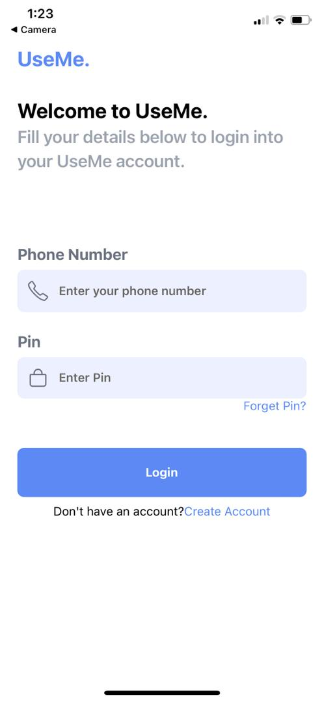  
  _Login screen showcasing user authentication._

- **Sign Up Screen**  
  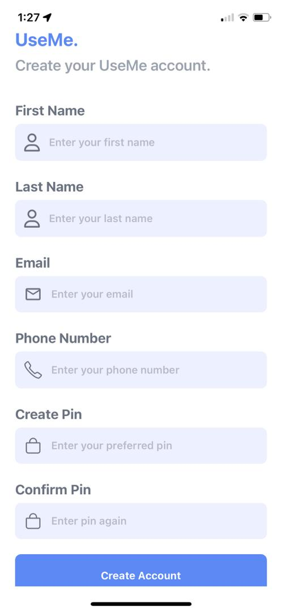  
  _Sign-up screen for new users._

- **Home Screen**  
  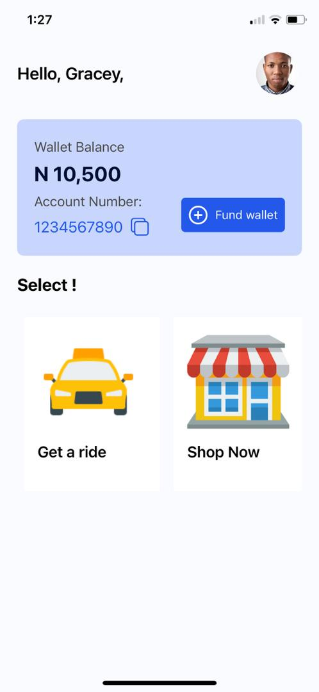  
  _Main screen with ride and shopping options._

- **Destination Screen**  
  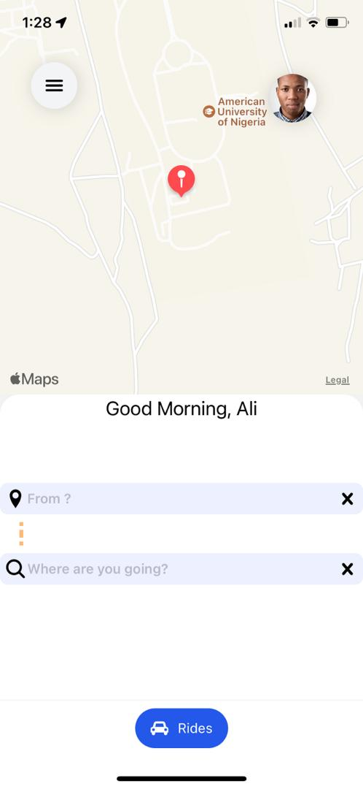  
  _Screen to select ride destination._

- **Ride Choice Screen**  
  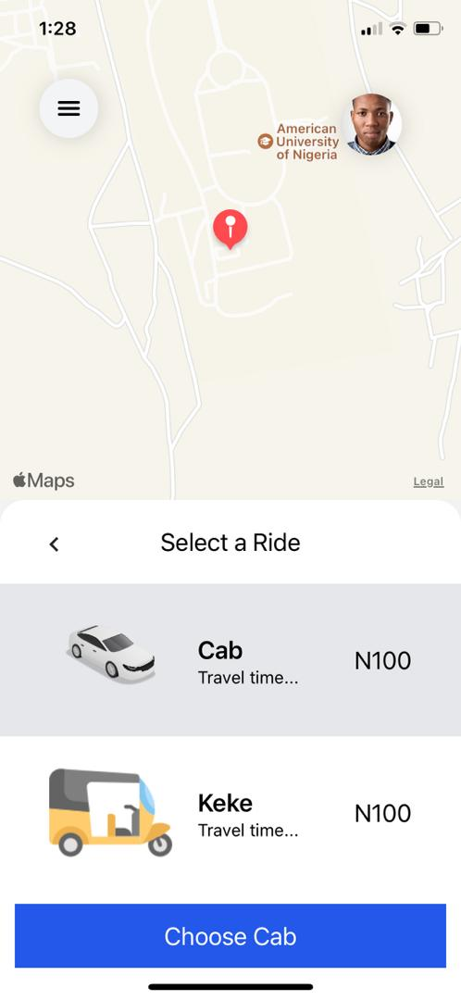  
  _Screen to choose between keke or cab._

- **Driver Approaching Screen**  
  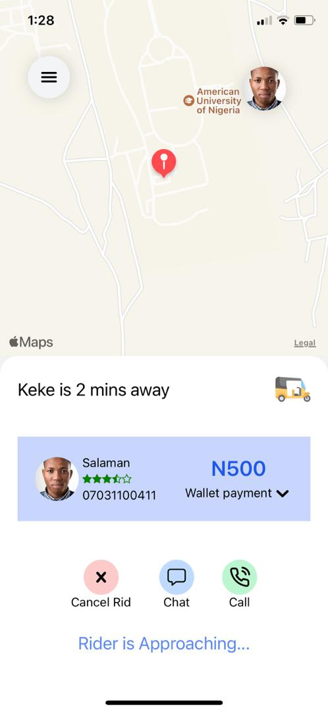  
  _Screen showing driver's arrival status._

- **Categories Screen**  
  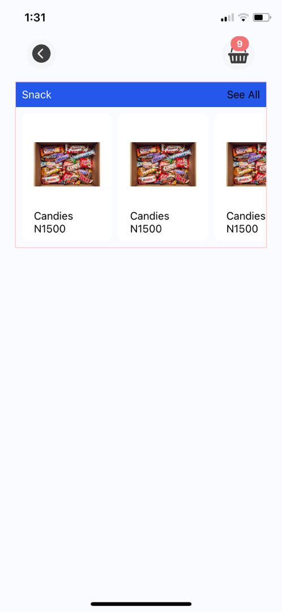  
  _Screen displaying product categories._

- **Category Products Screen**  
  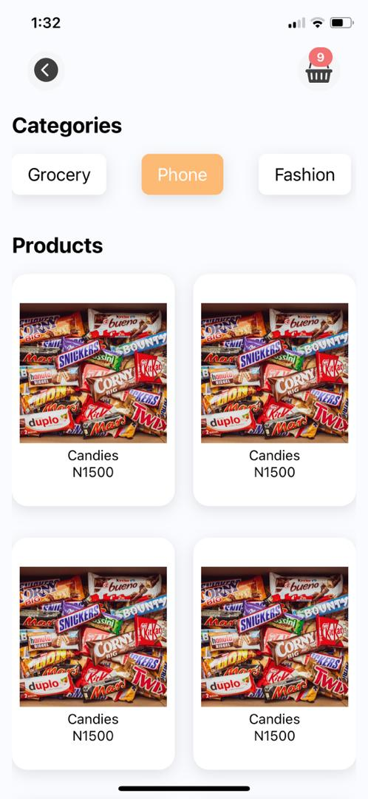  
  _Screen showing products within a category._

- **Product Detail Screen**  
  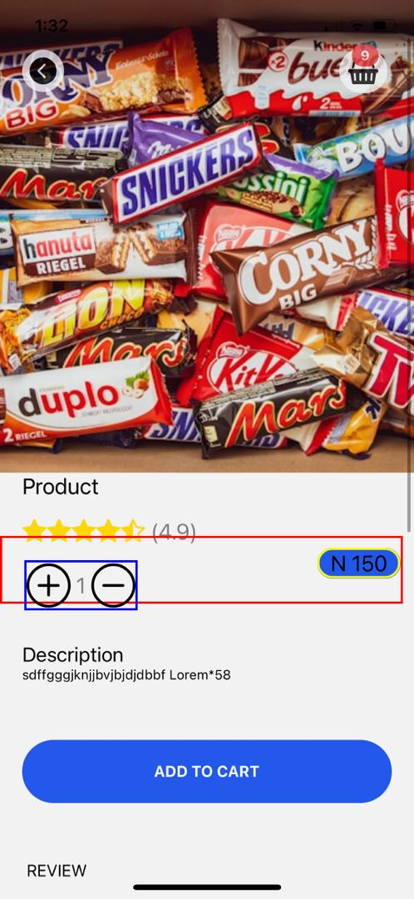  
  _Screen displaying product details._

- **Cart Screen**  
  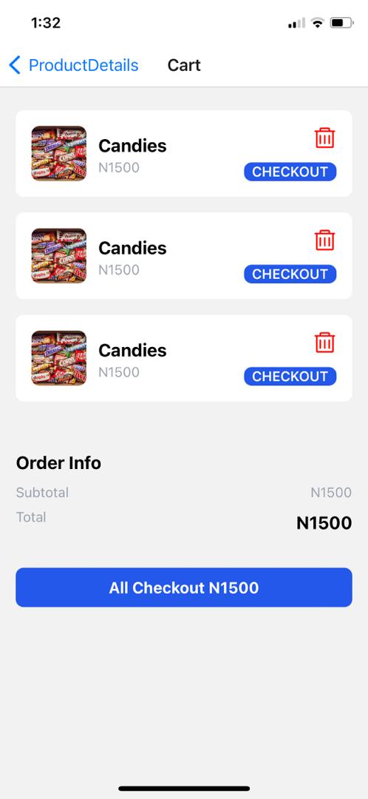  
  _Screen showing items in the cart._

- **Delivery Screen**  
  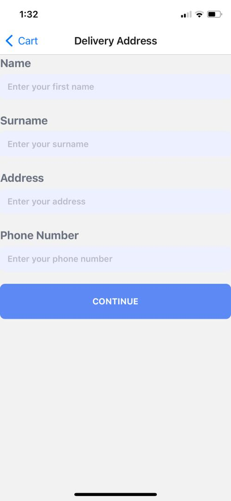  
  _Screen for delivery details._

- **Payment Screen**  
  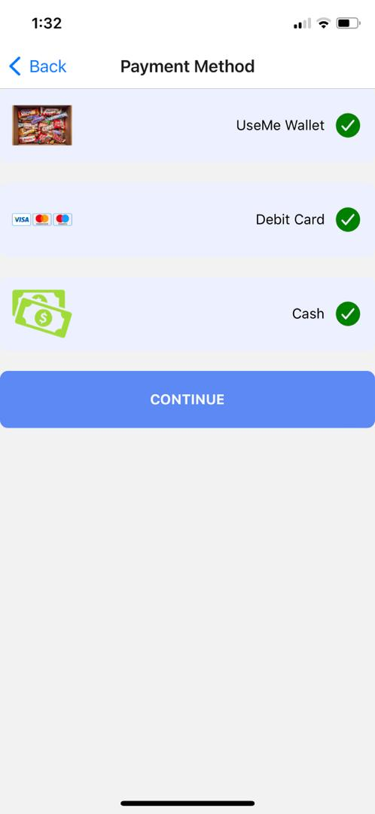  
  _Screen for payment processing._

- **Profile Screen**  
  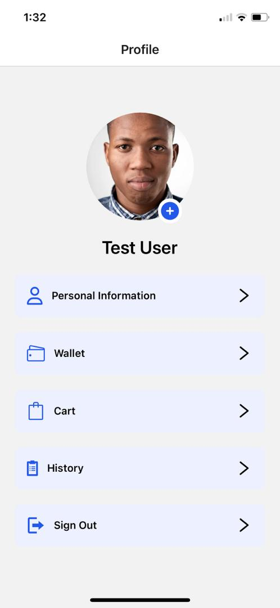  
  _Screen displaying user profile._

- **Wallet Screen**  
  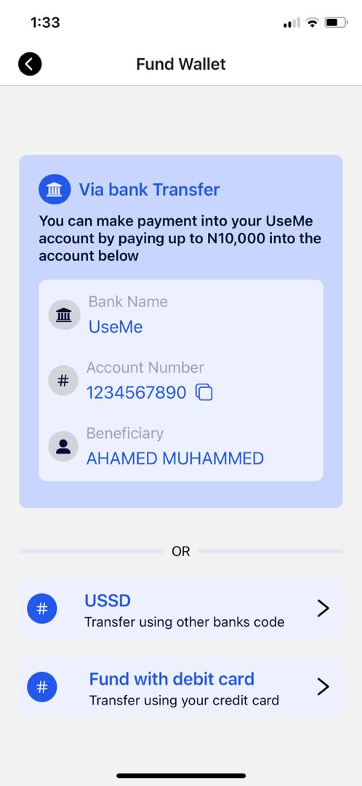  
  _Screen showing wallet balance and transactions._

---

For more details, view the `appFlow` directory to explore the app's flow further.
